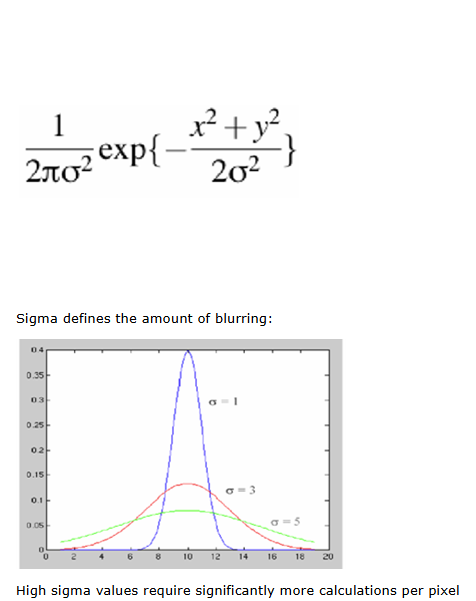

# cv-examples
### Gaussian Filtering
- The Gaussian Smoothing Operator performs a **weighted average** of surrounding pixels
  based on the Gaussian noise and is a realistic model of de-focused lense
  - Sigma defines the amount of blurring.
  
- Examples
  - 